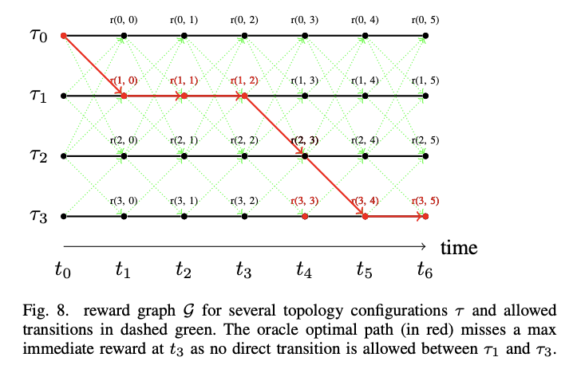
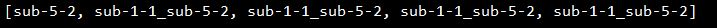
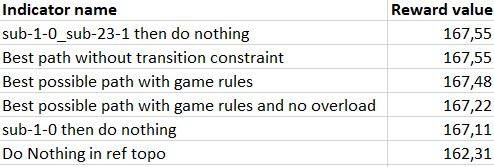
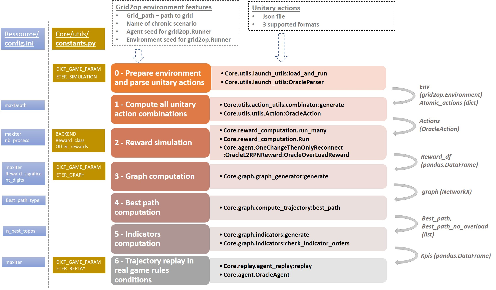

# Oracle4Grid

This is a repository to compute an Oracle score on a scenario for a given Grid2op environment.
It finds the best course of actions a posteriori, within a given perimeter of actions (cf « Learning to run a power network challenge for training topology controllers »)

An Oracle system is defined by it's ability to know all possible outcome,
in order to deduce the best course of actions. Named after an Oracle, who knows the future.

This is an Oracle System that tries to brute force the best possible combination of actions taken by an agent, in a certain Grid2op environment.
It does so by using data from a set of user-fed actions played in a dummy environment that allows any actions.
It then finds the best possible course of actions that an agent can take, called "Best path" (computed with or without possibility of overload).
Finally, a few KPIs are produced in order to give a quick rundown of the state of the environment initially provided.

This can allow you to test the boundaries of a given network environment, the feasibility of a given scenario or get a better understanding of the potential weaknesses
in the decision making process of an agent

**Table of Contents**
*   [1 Documentation](#documentation)
*   [2 Run](#run)
*   [3 Results](#results)
*   [4 Installation](#installation)
*   [5 User configuration](#configuration-for-the-user)
*   [6 Workflow and API overview](#workflow-and-api-overview)
*   [7 Tests](#tests)
*   [8 License](#license-information)

## Documentation
You can find the more comprehensive documentation on ReadTheDocs:
https://oracle4grid.readthedocs.io/en/latest/

## Run

Run example (from the root folder)

``
pipenv run python -m oracle4grid.main -d 1 -f oracle4grid/ressources/actions/rte_case14_realistic/test_unitary_actions.json -e data/rte_case14_realistic -c 0
``

- -d/--debug: If 1, prints additional information for debugging purposes. If 0, doesn't print any info
- -f/--file: Directory path to .json file containing all atomic actions we want to play 
- -e/--env: Directory path or name of the Grid2op environment to load
- -c/--chronic: Name or id of chronic scenario to consider, as stored in chronics folder. By default, the first available chronic scenario will be chosen
- -as/-agent_seed: Agent seed to be used by the grid 2op runner. By default, None is considered.
- -es/-env_seed : Environment seed to be used by the grid 2op runner. By default, None is considered.

For more customisation options, see section "Configuration for the user" below

## Results

Oracle returns 2 different action path that respect the game rules allowed transitions (see **Constants** section)

* *The best path*. Two level of representation are returned: a list of OracleAction and a list of Grid2op.Action
* *The best path* without overload, with the two same levels of representation

When printed, the OracleActions have a simple representation. For example sub-1-2_line-4-3 combines the second and third unitary actions that impacts respectively substation 1 and line 4
The best path can look as below

Additionaly, a Pandas.DataFrame with interesting cumulated rewards for various standard behaviour (indicators) is returned in order to give context and boundaries to the performance of Oracle but also your agents.

See the documentation for further details about the results through a simple use case. In debug mode, more info will be printed and serialized.

## Installation

For normal usage :

- [Optional] create a virtual environment for running the program :
  ``pipenv install ``
  ``pipenv shell ``
  
- Install :
``pip install oracle4grid``

For development, please proceed as follows:
- Create a pipenv environment with required dependencies. It will install from the Pipfile
``pipenv install
``
- [Optional] Install lightsim2grid to speed up powerflow simulation. Instructions at: https://github.com/BDonnot/lightsim2grid. Otherwise, you can use PandaPowerBackend.
- To generate a jupyter kernel from this environment
``
pipenv run ipython kernel install --user --name=<YourEnvName>
``
- [Optional] Enable tqdm to paralelize in jupyter notebooks
``
jupyter nbextension enable --py widgetsnbextension
``

- [TEMPORARY]  Install the forked grid2op
Checkout the forked grid2op version, NOT in the oracle4grid repository

`git clone https://github.com/mjothy/Grid2Op.git`

`git checkout -b mj-devs-pr`

`cd Grid2Op/`

`pip install -U .`

## Configuration for the user

### Config.ini
The main configuration of the oracle module is located in ./oracle4grid/ressources/config.ini
This file contains the following options :

- Max atomic actions to combinate:
*max_depth = 5*

- Max timestep to reach in episode
*max_iter = 5*

- Number of significant digits for reward, don't write value if you don't want to truncate and the parameter will be None:
*reward_significant_digit*

- Number of threads the computation engine is allowed to use:
*nb_process = 1*

- Computation type for finding path "shortest|longest":
*best_path_type = longest*

- Number of topos in best path to compute in indicators:
*n_best_topos = 2*

- Path to folder in which to write outputs in debug mode:
*output_path = "oracle4grid/output"*

### Unitary (atomic) actions

Oracle requires a base of atomic actions which are provided in .json format.
These unitary elements plays the role of action "bricks" that will be combined by Oracle to build more consistent actions on the grid.

As a limitation, two types of atomic actions are handled, each one having a standard format:

* An atomic action which impacts **one** substation topology - i.e. setting buses of assets (lines origins, lines extremities, generators, loads)
    ``{"sub": {"1": [{"lines_id_bus": [[0, 2], [2, 2]], "loads_id_bus": [[0, 2]], "gens_id_bus": [[0,2]]}}``
* An atomic actions that disconnects **one** line
    ``{"line": {"4": [{"set_line": -1}]}}``

A user-friendly notebook is provided to help the user defining atomic actions and visualize their impact on the grid. See *oracle4grid/core/actions_utils/Atomic_Actions_Helper.ipynb*

2 other formats are handled by class *oracle4grid/core/utils/launch_utils::OracleParser*. It should be easy for a user to develop an additional parser to handle his action format using the same API

* An explicit format for substation topologies (parser1) - examples in *oracle4grid/ressources/neurips_track1*
    ``{"set_bus": {"substations_id": [[16, [1, 1, 1, 2, 2, 1, 1, 1, 2, 1, 1, 2, 1, 1, 1, 1, 2]]]}}``
* An explicit format for whole action space (parser2) - examples in *oracle4grid/ressources/wcci_test*
    ``{"sub": {"1": [{"set_configuration": [0, 0, 0,..., 2, 0, 0, ..., 0, 0]}}}``

### constants.py
In addition to the ini file, there is a constant API available for easy local overrides of some common behaviors / implementations. Especially if one wants to use its customized reward function, or some other indicators that can be computed by "other_rewards" and used as path filters to derive some kpis.
This API can be used in two ways :
- Local override :
You may change the file itself to experiment with the different parameters of the API. See the comments in the file.
- API override :
The main function (load_and_run() and oracle()) of the Oracle allow for a constants argument that you can pass. It is usually an instance of a sub-class of the default implementation

## Workflow and API overview

## Tests

There are a lot of integration tests already implemented, one can run them with :

`python -m pytest oracle4grid/test --verbose --continue-on-collection-errors -p no:warning`

## License information
Copyright 2020-2021 RTE France

    RTE: http://www.rte-france.com

This Source Code is subject to the terms of the Mozilla Public License (MPL) v2 also available 
[here](https://www.mozilla.org/en-US/MPL/2.0/)
