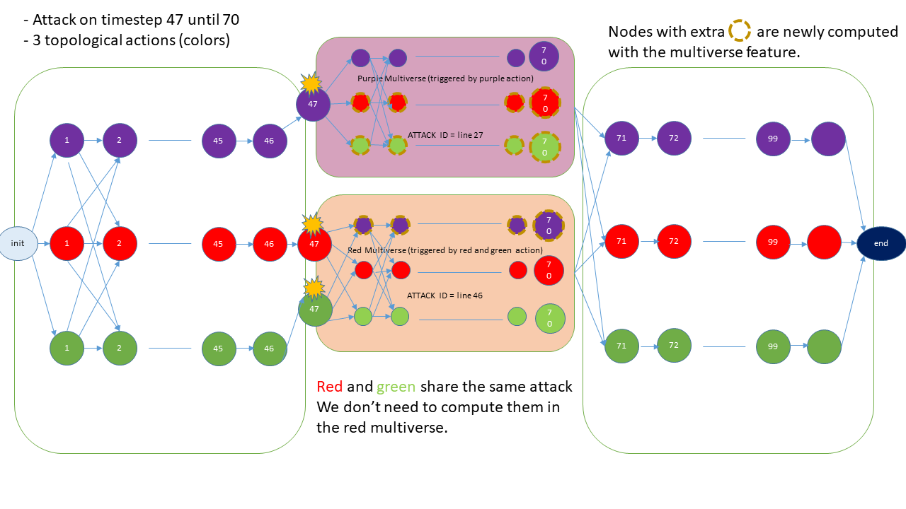

Introduction
============
Grid2op has support for opponent modeling in 1.5.0
This required some drastic changes for the Oracle logic, since each attack could lead to new simulation outcome that can be part of the optimal path taken by an agent.
This bit of documentation will first explain briefly how attacks works, and the hypothesis we made for the Oracle, then we will dive deeped into the implementation.

Attacks in Grid2op
=======================
In some environment, an OpponentAgent may take actions during a simulation to hinder the ability of an agent to manage the network.
This opponent has a budget, and a type of actions it can do on the network.
Here are the main hypothesis the Oracle regarding the Opponent logic :

- The opponent may only take PowerLineSetAction

- The opponent operates on certain window of time [begin, end], these windows are the same regardless of the current state of the network

- The opponent always chooses the same action when the network is in a certain topological state

- During a window of attack, the opponent will not change it's action from begin to end of window

Attacks in Oracle, About the Multiverse
=======================================

If there are no opponents, the Oracle simply has to compute every timestep of every action, and create a graph to know which path are possible between actions, and compute the best path
With opponent, each action (or topological state) can be 'hit' by a different attack . This topological state will always be hit by the same attack, at the same timesteps.
It is impossible for an agent path to jump from one attack (line id) to another within a window of attack, because of the previous hypothesis :

- During a window of attack, the opponent will not change it's action from begin to end of window

This means that we have to make sure, during the window of attack, that every single topological state that the Oracle oversees is also simulated during each attacks or, universe.
The resulting graph of all universes (that we call Multiverse) looks like this :

In this image, we can see three topologies (OracleActions) to simulate. The purple topologie is attacked at t=47 on line 27, and the green and red topologies
are attacked at t=47 on line 46. The multiverse algorithm computed the purple topologies with the attack on line 46, and the green & red topologies with the attack on
line 27.

Step by Step of the algorithm
==============================

* **[OracleAction computing] Compute all oracleactions from t=0 to tmax**
    This is the usual simulation performed by the oracle. We start here, with the rewards from these simulations

* **0 - Determination of the windows of attack**
    We loop over each simulation to find when the attacks occur, and which lines where attacked. Thie gives a dictionary with the timesteps, the line attacked, and the topologies affected
* **1 - Compute all permutations not computed before**
    For each window, each attack, we simulate a mini-simulation of just the window, with each topology that wasn't attacked by this attack. This fills the golden bordered nodes in the image above.
* **2 - Edges creation**
    We then link the edges as shown in the image, by replicating the edge pattern within the attack multiverse.