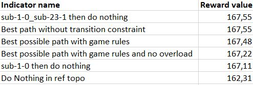

Introduction
============

An Oracle system is defined by it's ability to know all possible outcome,
in order to deduce the best course of actions. Named after an Oracle, who knows the future.

This is an Oracle System that tries to brute force the best possible combination of actions taken by an agent, in a certain Grid2op environment and on a given episode.
It does so by using data from a set of user-fed actions played in a dummy environment that allows any actions.
It then finds the best possible course of actions that an agent can take, called "Best path" (computed with or without possibility of overload).
Finally, a few KPIs are produced in order to give a quick rundown of the state of the environment initially provided.

This can allow you to test the boundaries of a given network environment, and get a better understanding of the potential weaknesses
in the decision making process of an agent

The following sections are dedicated to describe each step of the process of Oracle, the API features and the results it provides.
It will go through a didactic example to follow each step in a detailed manner

Process Overview
=======================

* **[Preliminary step] Easily create your own unitary actions visually**
    A notebook is provided in *oracle4grid/core/action_utils/Atomic_Actions_Helper.ipynb*. Follow the steps to visualize your grid and the impact of your unitary (atomic) actions on it thanks to grid2op plot API and dedicated functions in *core/utils/action_generator* that you'll learn to use.

    .. image:: images/notebook_screen.JPG

    The supported actions are actions on buses (on substation topologies) and line disconnection.
    You'll eventually write your unitary actions in a json format which will be directly usable by Oracle.

* **0 - Prepare environment and parse unitary actions**
    The grid2op environment for action simulations is prepared with provided parameters, the unitary actions are formatted to oracle format (3 formats are supported, a parser API is provided)
* **1 - Compute all unitary action combinations**
    We create OracleAction objects that correspond to the possible combinations of unitary actions (with a given maximum combination depth). It embeds a valid grid2op action format for simulation in next step.
    First filters are applied to actions if they cause divergence at the first timestep of the episode or if they don't have any effect on the initial topology
* **2 - Reward simulation**
    Each OracleAction is simulated by being applied alone on the grid, with possible parallel computation. We retrieve the rewards obtained at each timestep and the overloads - or any reward set in other_rewards
* **3 - Graph computation**
    From the previous simulation, a networkX graph is computed, its nodes being actions at given timesteps, each edge representing a possible transition from one action to the other, weighted by the corresponding reward
* **4 - Best path computation**
    The path that minimizes or maximizes the cumulated reward is calculated thanks to networkX API (Bellman-Ford algorithm and DAG longest path). 2 trajectories are provided: with or without possibility of overflows in the grid
* **5 - Indicators computation**
    Some useful indicators are computed. See details in **Indicators** section
* **6 - Trajectory replay in real game rules conditions**
    The best path is played by an OracleAgent, with possibly more comprehensive game rules that could be explicitly taken into account previously. It warns the user if these game rules lead to game over or diverging timesteps (if the expected cumulated reward is not matched)

All along this process, some objects are serialized if you chose debug=1. This will be detailed in section **Output structure in debug mode**

Process detailed implementation
================================

.. image:: images/detailed_workflow.JPG

.. _didactic-example:

Didactic example
=================

In this section, we'll dig into the algorithm of Oracle with a simple example.
You'll be more familiar with the important objects of Oracle and see in particular those which are serialized in debug mode

Grid, actions and configuration
^^^^^^^^^^^^^^^^^^^^^^^^^^^^^^^^^^^^^^^^
The grid is wcci_test which has 35 nodes (provided in *data/wcci_test/*)

Two unitary actions will be considered. They have been taken from the competition and are provided
in *oracle4grid/ressources/actions/wcci_test/2actions_winner_format2.json*. They follow the following format:

.. code-block:: python

 {"sub": {"1": [{"set_configuration": [0, 0, 0,..., 2, 0, 0, ..., 0, 0]}}}
 {"sub": {"23": [{"set_configuration": [0, 0, 0,..., 2, 0, 0, ..., 0, 0]}}}

Which is parsed by OracleParser to:*

 .. code-block:: python

     {'sub': {1: {'gens_id_bus': [[0, 1]],
                  'lines_id_bus': [[3, 2], [4, 2], [12, 1]],
                  'loads_id_bus': [[2, 1], [3, 2]]}}}
     {'sub': {23: {'gens_id_bus': [[11, 1], [12, 1], [13, 1]],
                   'lines_id_bus': [[30, 2],
                                    [31, 2],
                                    [32, 2],
                                    [34, 1],
                                    [37, 1],
                                    [38, 1]],
                   'loads_id_bus': [[24, 1]]}}}]

We can see that those two action have an impact on substations 1 and 23 respectively

In config.ini, we set max_iter to 4, to simulate 4 timesteps. We set max_depth to 2 as we will only need to combine a maximum of 2 actions.

Action combinations
^^^^^^^^^^^^^^^^^^^^

We generate 4 OracleAction which have the following representation of atomic actions: ``sub-<id of substation>-<id of atomic action>``.

When combinated, the atomic actions are separated by an underscore

``[sub-1-0, sub-23-1, sub-1-0_sub-23-1, donothing-0]``

In this step, actions can be filtered out if they cause a divergence at the first simulation timestep or if they don't have impact on the initial topology
There is no filtering needed here

.. image:: images/didactic_step1.JPG

Reward simulation
^^^^^^^^^^^^^^^^^^^^

Each OracleAction is applied on grid and the whole episode is then simulated in parallel by agent OneChangeThenOnlyReconnect

.. image:: images/didactic_step2.JPG

The resulting reward_df is a pandas.DataFrame representing the reward obtained at each timestep of those parallel simulation. it also includes whether there has been an overflow in the timestep (overload_reward = 0)

This dataframe is serialized in the output folder (reward_df.csv)

Graph computation
^^^^^^^^^^^^^^^^^^^^

A graph is computed thanks to the result of this simulation

.. image:: images/didactic_step3.JPG

* The nodes of the graph represent actions (vertical axis) at a given time step (horizontal axis)
* The edges represent transitions between actions, they are permitted or not according to the provided game rules. These game rules are in ``constants.DICT_GAME_PARAMETERS_GRAPH`` and consist exclusively in limiting the number of impacted substation (for actions on topology) and impacted lines (for disconnection actions)
* The weights on the edges represent the reward obtained when operating the edge transition
* The init and end node don't represent any grid state, they are required in networkX for a proper computation of the best trajectories

.. code-block:: python

    DICT_GAME_PARAMETERS_GRAPH = {'MAX_LINE_STATUS_CHANGED': 1,
                                  'MAX_SUB_CHANGED': 1}

Here you can see that **a maximum of one substation** can be impacted in each timestep, which is why ``sub-1-0_sub-23-1`` can't be applied in one timestep

In debug mode, this graph is serialized under different formats:

* *edge_list.csv* - representing source target and weight of each edge in the graph under a table format
* *graphe.pkl* - a pickle containing the networkX object
* *graphe.PNG* - a picture of the graph layout, with same structure as the previous image

Best path computation
^^^^^^^^^^^^^^^^^^^^^^^

Two best trajectories are computed in order to maximise the cumulated OracleL2RPNReward (longest path has been chosen in config.ini)

* One with no regard on overloads (orange) - action ``sub-1-0_sub-23-1`` retrieves an advantageous cumulated reward but leads to overloads. It is reached in 2 timesteps because the transition cannot impact two substations at a time, as specified by game rules
* One avoiding overloads (yellow) - action ``sub-1-0`` retrieves a less advantageous cumulated reward but doesn't lead to any overload

.. image:: images/didactic_step4.JPG

We'll see the difference between those cumulated rewards in the indicators section

In debug mode, this best path is serialized under different formats:

* *best_path_grid2op_action.pkl* - a pickle containing the grid2op.Action that enable one to replay this trajectory in a grid2op simulation
* *best_path_grid2op_action_no_overload.pkl* - same for the path without overload
* *best_path_topologies_count.PNG* - a picture containing the frequency of the n most-played topologies in best path (n being the n_best_topos parameter in config.ini)

.. image:: images/best_path_topologies_count.PNG

* *best_path_no_overload_topologies_count.PNG* - same for the path without overload

.. image:: images/best_path_no_overload_topologies_count.PNG

Indicators computation
^^^^^^^^^^^^^^^^^^^^^^^

A set of indicators (KPI) is computed in order to appreciate the boundaries of the cumulated reward that can be obtained under different hypothesis

A specific order in rewards must be respected. Otherwise a ValueError is raised:

* Doing nothing cannot be strictly better than the best path
* The best path respected transition rules cannot be strictly better than the best path with no constraint
* The best path with no overload cannot be strictly better than the best bath

.. note::
   The indicators "<action> then do nothing" are computed for the n best actions (n being the n_best_topos parameter in config.ini). We don't know where this indicator will be in the cumulated reward hierarchy

The KPI table is returned as a pandas.DataFrame and serialized in debug mode (kpis.csv)

Trajectory replay in real game rules conditions
^^^^^^^^^^^^^^^^^^^^^^^^^^^^^^^^^^^^^^^^^^^^^^^^

The best path is replayed by OracleAgent under real game rules conditions (``constants.DICT_GAME_PARAMETER_REPLAY``). The user is warned if one of the two following cases occurs:

* If there is a game over in the episode and the simulation doesn't reach the end of the episode. The replay function returns the number of survived time steps
* If the expected cumulated reward is not matched (meaning that there have been overloads causing null rewards for example)

In our example, the expected cumulated reward is not matched because of the overloads caused by action ``sub-1-0_sub-23-1`` that we had already noticed.
This generates the following warning:

.. warning::
    UserWarning: During replay - oracle agent does not retrieve the expected reward. Some timestep may have break some game rules in real condition. Expected reward: 167.48158645629883 Reward obtained: 125.66283416748047

In debug mode, the grid2op Runner will write the simulation logs in the output directory, within a separate folder (*replay_logs*)

Output structure in debug mode
^^^^^^^^^^^^^^^^^^^^^^^^^^^^^^^^^^

If debug=1, all the elements mentioned above will be serialized in the same folder.

* If a parameter *output_path* is provided in config.ini, this folder is used as root output folder
* Else, a folder oracle4grid/output will be written in the current working directory

Then Oracle will build an arborescence

* output folder
    * scenario_<chronic id or name>
        * <Name of unitary action json>
            * reward_df.csv
            * graphe.pkl
            * graphe.PNG
            * edge_list.csv
            * kpis.csv
            * best_path_grid2op_action.pkl
            * best_path_grid2op_action_no_overload.pkl
            * best_path_topologies_count.PNG
            * best_path_no_overload_topologies_count.PNG
            * replay_logs/..

.. _parsing:

Action parsing
=================

As an internal use convention, Oracle uses a reference format for unitary actions:

* For a unitary action that impacts **one** substation topology - i.e. setting buses of assets (lines origins, lines extremities, generators, loads)
    ``{"sub": {"1": [{"lines_id_bus": [[0, 2], [2, 2]], "loads_id_bus": [[0, 2]], "gens_id_bus": [[0,2]]}}``
* or a unitary action that impacts **one** line
    ``{"line": {"4": [{"set_line": -1}]}}``

A user-friendly notebook is provided to help the user define atomic actions and visualize their impact on the grid. See *oracle4grid/core/actions_utils/Atomic_Actions_Helper.ipynb*

If unitary actions are directly provided in other formats, a parser API is available to convert it into the right conventional format.
It is done through the class *oracle4grid/core/utils/launch_utils::OracleParser*.
On top of that, warnings and errors are returned in case the actions provided don't have sense in the action space
(e.g. impact an asset that is not connected to the substation)

There are currently two additional formats that are handled by OracleParser:

* An explicit format for substation topologies (parser1) - examples in *oracle4grid/ressources/neurips_track1*
    ``{"set_bus": {"substations_id": [[16, [1, 1, 1, 2, 2, 1, 1, 1, 2, 1, 1, 2, 1, 1, 1, 1, 2]]]}}``
* An explicit format for whole action space (parser2) - examples in *oracle4grid/ressources/wcci_test*
    ``{"sub": {"1": [{"set_configuration": [0, 0, 0,..., 2, 0, 0, ..., 0, 0]}}}``