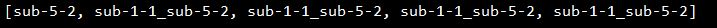

***************
Getting Started
***************

Launch Oracle4Grid
====================

To execute in **manual mode**, from root folder, type:

``pipenv run python -m main -d 0 -f "oracle4grid/ressources/actions/rte_case14_realistic/test_unitary_actions.json" -e "data/rte_case14_realistic" -c 0``

--debug | -d int
                            if 1, prints additional information for debugging purpose, but also serializes some result files in output folder (see dedicated chapter **Results**)
                            If 0, doesn't print detailed info
--file | -f string
                            File path to a json file containing atomic actions to be played. See dedicated chapter **Atomic actions**
--env | -e string
                            Path to directory containing the grid2op environment and its chronics
--chronic | -c
                            Name (string) or id (int) to the episode we want to consider. By default, the first available chronic will be chosen. Oracle4Grid only runs for one episode.
--agent_seed | -as
                            Agent seed to be used by the grid 2op runner. By default, None is considered.
--env_seed | -es
                            Environment seed to be used by the grid 2op runner. By default, None is considered.

See **Algorithm Description section** to learn more about the workflow and results.

Atomic actions
================

Oracle requires a base of atomic actions which are provided in .json format.
These unitary elements plays the role of action "bricks" that will be combined by Oracle to build more consistent actions on the grid.

As a limitation, two types of atomic actions are handled, each one having a standard format:

* An atomic action which impact **one** substation topology - i.e. setting buses of assets (lines origins, lines extremities, generators, loads)
    ``{"sub": {"1": [{"lines_id_bus": [[0, 2], [2, 2]], "loads_id_bus": [[0, 2]], "gens_id_bus": [[0,2]]}}``
* An atomic actions that disconnects **one** line
    ``{"line": {"4": [{"set_line": -1}]}}``

A user-friendly notebook is provided to help the user defining atomic actions and visualize their impact on the grid. See *oracle4grid/core/actions_utils/Atomic_Actions_Helper.ipynb*

2 other formats are handled by class *oracle4grid/core/utils/launch_utils::OracleParser*. It should be easy for a user to develop an additional parser to handle his action format using the same API

* An explicit format for substation topologies (parser1) - examples in *oracle4grid/ressources/neurips_track1*
    ``{"set_bus": {"substations_id": [[16, [1, 1, 1, 2, 2, 1, 1, 1, 2, 1, 1, 2, 1, 1, 1, 1, 2]]]}}``
* An explicit format for whole action space (parser2) - examples in *oracle4grid/ressources/wcci_test*
    ``{"sub": {"1": [{"set_configuration": [0, 0, 0,..., 2, 0, 0, ..., 0, 0]}}}``

See more details in section :ref:`parsing`

Configuration
===============

Configuration is made through oracle4grid/ressources/config.ini

* *max_depth* - Maximum number of atomic actions to combine for creation of oracle actions
* *max_iter* - Maximum timestep to simulate in the episode
* *reward_significant_digit* - Number of significant digits for reward, don't write value if you don't want to truncate and the parameter will be None
* *nb_process* - Number of threads the computation engine is allowed to use
* *best_path_type* - shortest or longest - Decides whether oracle should find the path that maximizes or minimizes the reward
* *n_best_topos* - Number of topos in best path to compute in indicators

Results
================

Oracle returns 2 different action path that respect the game rules allowed transitions (see **Constants** section)

* *The best path*. Two level of representation are returned: a list of OracleAction and a list of Grid2op.Action
* *The best path* without overload, with the two same levels of representation

When printed, the OracleActions have a simple representation. For example sub-1-2_line-4-3 combines the second and third unitary actions that impacts respectively substation 1 and line 4
The best path can look as below

Additionaly, a Pandas.DataFrame with interesting cumulated rewards for various standard behaviour (indicators) is returned in order to give context and boundaries to the performance of Oracle but also your agents.

.. image:: images/didactic_step5.JPG

See :ref:`didactic-example` section for more details about the results through a simple use case. In debug mode, more info will be printed and serialized.

Agent replay
================

An agent is provided in order to replay the best path (*oracle4grid/core/agent/OracleAgent.py*)
To facilitate the agent, oracle4grid replays it once in order to check in **real game rules condition**

* if a game over occurs (it also prints number of survived timesteps)
* if the expected cumulated reward is obtained (it could not be the case if overloads occur in path and leads to null rewards)

Two types of warning can be returned accordingly

Constants
===============

in addition to config.ini, there is a constant API available for easy local overrides of some common behaviors / implementations.
This API can be used in two ways :

* *Local override* : You may change the file itself to experiment with the different parameters of the API. See the comments in the file.
* *API override* : The main function (load_and_run() and oracle()) of the Oracle allow for a constants argument that you can pass. It is usually an instance of a sub-class of the default implementation

It can be found in *oracle4grid/core/utils/constants.py*

You can currently modify three main features in the constants:

* The Grid2op Backend used for simulations
* The main reward and additional other rewards to be used
* The game rules in simulation, in graph computation and in replay conditions

Tests
=====

To launch the test suite:
``pipenv run python -m pytest --verbose --continue-on-collection-errors -p no:warnings``

